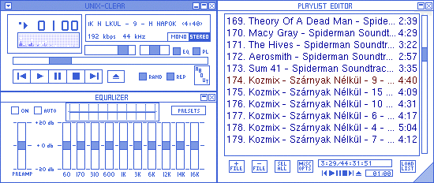
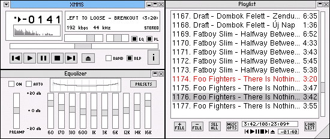
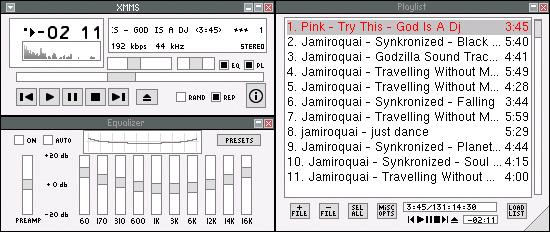
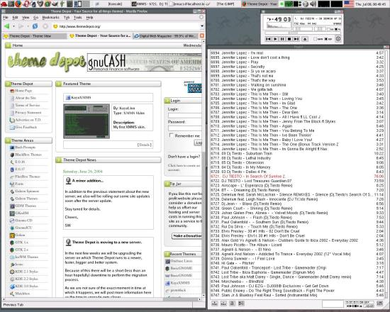

Skins and Themes
================

There lives 3 XMMS skins and 1 Metacity theme which I created in 2004.  You can find and rate all this stuff from [my Gnome-Look.org user profile](http://gnome-look.org/usermanager/search.php?username=mondalaci).  Here's how they look:

Unix-clear XMMS skin:

m7c XMMS skin:

Explicit Flatness XMMS skin:

Explicit Flatness Metacity theme:

